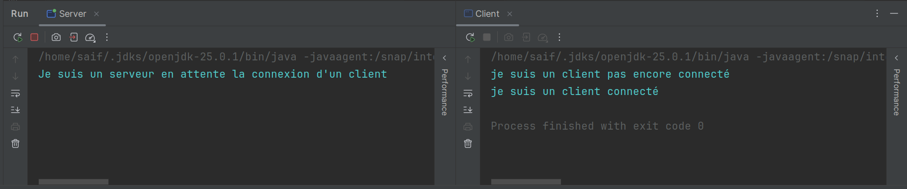
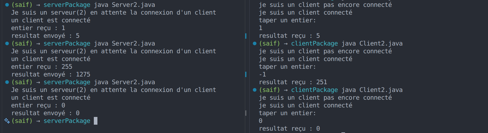
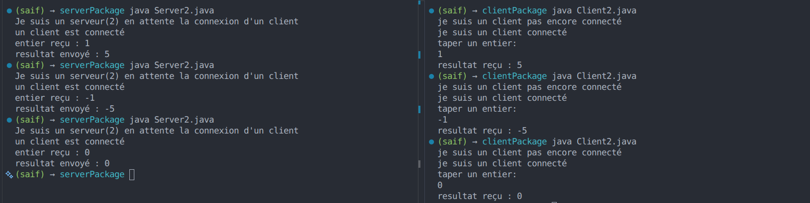
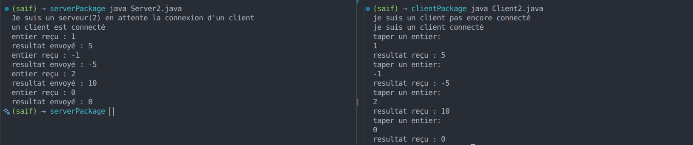

# TP1

## Activité 1

## Activité 2
### 2)

Le client reçoit 251 au lieu de -5 parce que la communication ne peut transporter qu'un petit nombre (entre 0 et 255), donc -1 est transformé en 255 avant d'arriver au serveur. Le résultat 1275 est trop grand pour passer aussi, alors il est coupé et devient 251 ; il faut donc utiliser une méthode qui envoie l'entier en entier (`writeInt`/`readInt`).

### 4) Exploiter les deux classes DataInputStream et DataOutputStream:

### 5) Échange de plusieurs entiers successivement:
